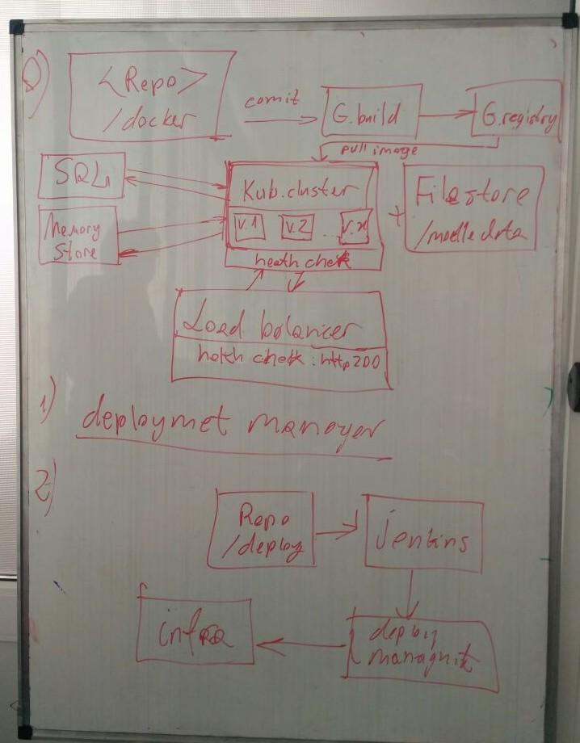

### DEMO 3: Prepare Google cloud infrastructure

**Task description**

For this demo we have to:
- prepare Docker file with Moodle LMS
- set up Cloud build for building Dockerfile into the image
- Create SQL instance
- Create Kubernetes cluster and provision it with our image
- Mount Filestore for moodledata
- Mount Redis for handling session
- Add health checks and set up notifications

Additional tasks:
- Create infrastructure using Deployment manager
- Create infrastructure using Jenkins

### Usage
*You must have Google free tier account if want to use this project*

Clone this repo
Docker image and script are ready for usage
For creating deployment via deployment manager you need gcloud sdk and some preparing [check quickstart page](https://cloud.google.com/deployment-manager/docs/quickstart)
After that execute commands from dm.sh

Other files are just helper files where I store some commands and sample. If you just run gcloud_run.sh it fails
